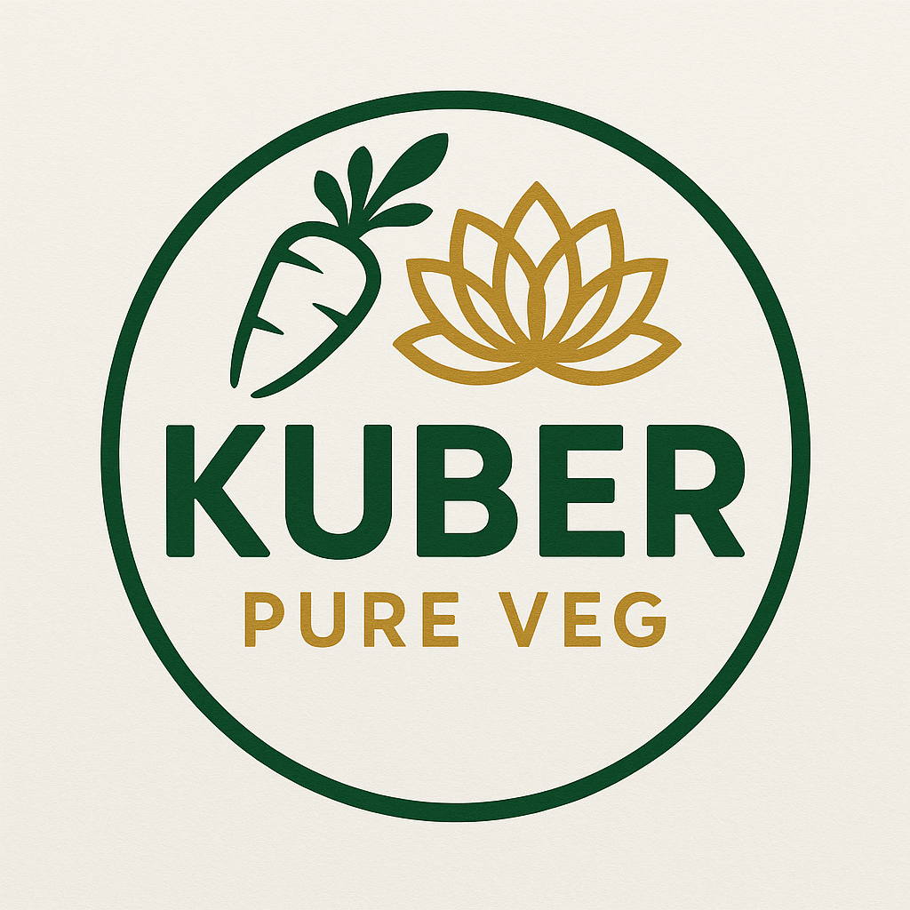

<!-- LOGO & TITLE -->
<p align="center">
  
</p>
<h1 align="center">Kuber Vegetarian Hotel</h1>
<p align="center"><em>Delicious vegetarian cuisine, beautifully presented.</em></p>

<!-- BADGES -->
<p align="center">
  <a href="#"></a>
  <a href="#"></a>
  <a href="#"></a>
  <a href="#"></a>
  <a href="#"></a>
</p>

<!-- NAVIGATION LINKS -->
<p align="center">
  <a href="#demo">Demo</a> •
  <a href="#report-bug">Report Bug</a> •
  <a href="#request-feature">Request Feature</a> •
  <a href="#faq">FAQ</a> •
  <a href="#ask-question">Ask Question</a>
</p>

<!-- LANGUAGE SELECTION -->
<p align="center">
  <b>Docs:</b>
  <a href="#">English</a> | <a href="#">हिंदी</a> | <a href="#">Español</a> | <a href="#">Français</a>
</p>

<!-- DONATION & NOTICE -->
<p align="center">
  <b>Support our mission!</b> <a href="https://www.buymeacoffee.com/HardikQuantumCybernetic"></a>
</p>
 

<!-- LIVE DEMO BADGE -->
<p align="center">
  <a href="https://kuberpureveg.netlify.app/" target="_blank">
    
  </a>
</p>


## 📑 Table of Contents
- [About](#about)
- [Features](#features)
- [Usage](#usage)
- [Customization & Theming](#customization--theming)
- [Deployment](#deployment)
- [Support & Contribution](#support--contribution)
- [License](#license)
- [Acknowledgments](#acknowledgments)

---

## 🥗 About
Kuber Vegetarian Hotel is a modern, responsive web app for vegetarian restaurants. It features a beautiful menu, interactive navigation, dark/light theming, and a mobile-friendly design.

---

## ✨ Features
<details>
<summary><b>Responsive Navigation Bar</b></summary>
<ul>
  <li>Hamburger menu for mobile</li>
  <li>Logo centered, theme switcher on the right</li>
  <li>Auto-close on navigation</li>
</ul>
</details>
<details>
<summary><b>Dark & Light Mode</b></summary>
<ul>
  <li>Toggle with a stylish switch</li>
  <li>Remembers user preference</li>
</ul>
</details>
<details>
<summary><b>Menu & Pages</b></summary>
<ul>
  <li>Dynamic menu cards</li>
  <li>Contact, About, and Location pages</li>
</ul>
</details>

---

## 🚀 Usage
```bash
# Clone the repo
$ git clone https://github.com/yourusername/yourrepo.git
$ cd yourrepo

# Open index.html in your browser
```

### Example: Embedding a Menu Card
```html
<div class="menu-card">
  
  <div class="menu-info">
    <div class="menu-title">Paneer Tikka</div>
    <div class="menu-price">₹180</div>
    <div class="menu-ingredients">Paneer, Spices, Veggies</div>
    <div class="menu-rating">⭐⭐⭐⭐⭐</div>
  </div>
</div>
```

---

## 🎨 Customization & Theming
- Edit `styles.css` to change colors, fonts, or layout.
- Update logo in `assets/logo.png`.
- Modify navigation links in `index.html`.

---

## ☁️ Deployment
### Deploy on Vercel
1. [Sign up for Vercel](https://vercel.com/)
2. Import your GitHub repo
3. Click "Deploy"

---

## 🤝 Support & Contribution
<p>
  <a href="https://github.com/HardikQuantumCybernetic/Kuber/issues">Report Bug</a> •
  <a href="https://github.comHardikQuantumCybernetic/Kuber/pulls">Request Feature</a> •
  <a href="https://github.comHardikQuantumCybernetic/Kuber/blob/main/CONTRIBUTING.md">Contribute</a>
</p>

<p>
  <a href="https://www.buymeacoffee.com/HardikQuantumCybernetic"></a>
</p>

---

## 📝 License
This project is licensed under the [MIT License](LICENSE).

---

## 🙏 Acknowledgments
- Thanks to all contributors and users!
- Inspired by modern restaurant web design.

